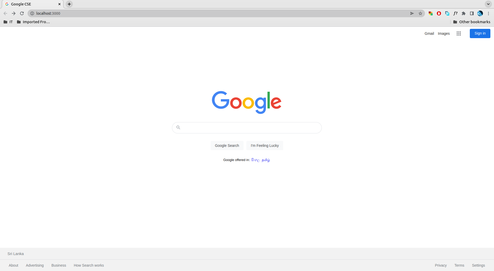
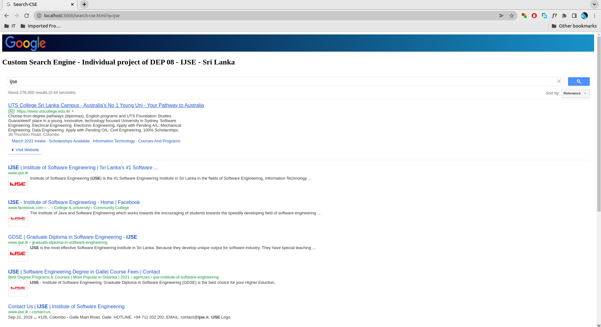

# Google Search Engine Clone with embedded Custom Search Engine

# Important!

***The entire project is developed for as experimental and educational purposes only. Ownership of all the logos, trademarks which are here applied owned to their original owners.***

# Introduction with project objectives

The project output consists of a cloned web interface of Google search engine; it functions as a custom search engine powered by the Google custom search engine service. It is reminded that this project is done for an experiment and educational purpose as enhancing the programming languages of HTML and CSS and that is also the main objective.

# Functioning and specialties.

The main web interface of the project is a clone of the Google search interface and all of the other services are function here excludes the voice search and directing to other services provided from Google. Especially,  here applied the properties of flex display type, media quarries, and other main CSS properties and this is a responsive web application up to 1200px width and it also functions in the devices which have a small display as 278px width.
The embedded Google’s custom search engine provided the respective search results.

# Feedback

Thank you for visiting to see the project and your feedback is highly appreciated. All the feedback can be given through GitHub.

# License

This project is licensed under [MIT](license.txt) License.
Copyright © 2022 Thanura Silva. All Rights Reserved. 